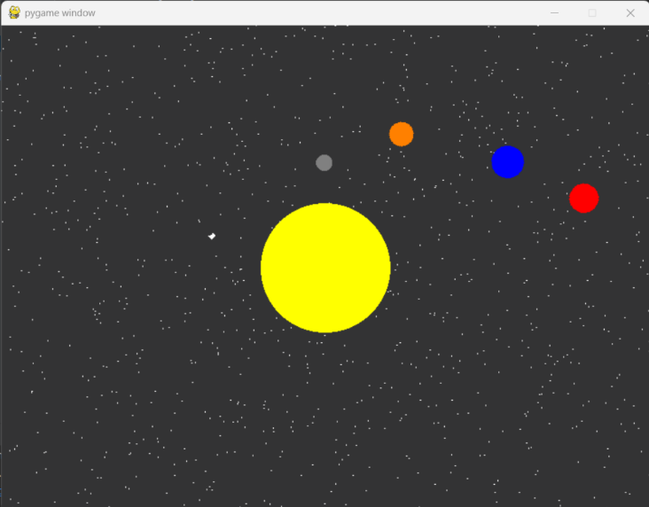

# Solar-System-Simulation

Welcome to our Solar System Simulation project! Here, we utilized the power of Pygame and OpenGL to create an immersive 2D simulation of our solar system. Pygame, a versatile Python package for game development, coupled with OpenGL's capabilities for 3D graphics, enabled us to bring the celestial bodies of our solar system to life on your screen.

## Project Features:
- Solar System Simulation: Experience the orbits and rotations of the Sun and four planets (Mercury, Venus, Earth, and Mars) in a visually captivating environment.

- Interactive Gameplay: Control with arrow keys, navigating through the simulated solar system amidst randomly generated stars.

- Efficient Algorithms: Leveraging algorithms such as the midpoint circle algorithm for drawing planets and Bresenham's algorithm for triangles ensures smooth rendering and efficient performance.

## Implementation Details:
- Technologies Used: Python 3.7, Pygame 2.0.1, OpenGL 3.3.

- Organized Structure: Modularized functions handle various aspects of the simulation, from drawing celestial bodies to managing user interaction.

- Frame Rate Control: A clock mechanism ensures a consistent frame rate of 60 frames per second, enhancing the simulation's fluidity.

## Future Scope:
- Educational Tool: Extend the project to include more celestial bodies like moons, asteroids, and additional planets, serving as an educational resource for students learning about astronomy.

- Enhanced Visualization: Continuously improve visual elements, such as adding textures and enhancing planetary details, for a more immersive experience.

## Contributions:
We welcome contributions from developers interested in enhancing the simulation, adding features, or optimizing performance. Join us in exploring the cosmos through code!

Explore the repository, dive into the code, and embark on a journey through our simulated solar system! 🌌🚀

## SnapShot:

